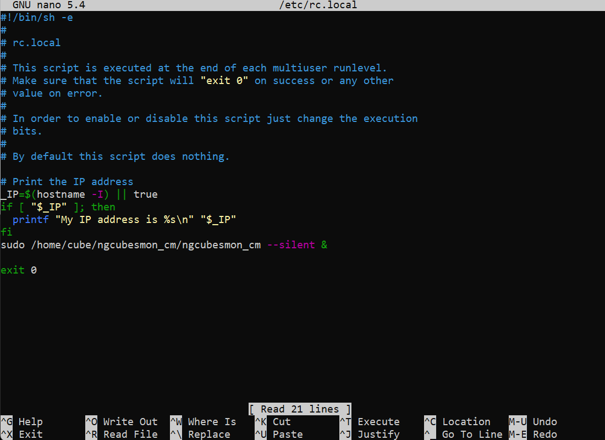

# ngcubesmon_cm
 Monitor and Shutdown Tool for NG Cubes - CM Version 

## Installation

 $ git clone https://github.com/Cube-Controls/ngcubesmon_cm.git
	
	$ cd ngcubesmon_cm

	$ make

### Run script using /etc/rc.local

Edit /etc/rc.local:
	
	$ sudo nano /etc/rc.local 

Using cursor keys scroll to the bottom and add next line before "exit 0":

      sudo /home/cube/ngcubesmon_cm/ngcubesmon_cm --silent &

To save these changes click “CTRL-X”, then “Y” and finally “Return”. You should now be back at the command prompt.

Reboot using :

	$ sudo reboot

----------

After starts up to test power plug can be unplugged , after 5 seconds script will start safe shutdown procedure and CM Module will shut down.

License
----

MIT 

 
	

